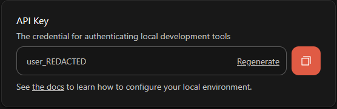

# Home Assistant TRMNL Integration

Monitor your TRMNL e-ink display devices from Home Assistant: battery voltage, battery percentage, WiFi signal (dBm and percent), and when the device was last seen.

## Prerequisites

This integration uses TRMNL's Account API, which requires the **Developer Edition** add-on on your account. You only need it once per account; a single licensed device can cover your other devices via Playlists. Without it you won't have an account **API Key** and setup will fail with `invalid_auth`.

The API Key is found at [trmnl.com/account](https://trmnl.com/account) and always starts with `user_`. See [TRMNL's Developer Edition add-on](https://help.trmnl.com/en/articles/11629486-calculating-byod-and-dev-edition-add-ons) for details.

## Installation

### Option 1: HACS (recommended)

Or add it manually: HACS, three-dot menu, "Custom repositories", add `https://github.com/Beat2er/homeassistant-trmnl-battery` (Category: Integration), install, then restart Home Assistant.

### Option 2: Manual

Copy the `custom_components/trmnl` directory into your Home Assistant `config/custom_components` directory and restart Home Assistant.

## Configuration

Add the integration via Settings, Devices & Services, "+ Add Integration", then search for "TRMNL". You can change these settings later via the integration's **Configure** option.

- **API Key** (required): your account API Key (see [Prerequisites](#prerequisites)). It always starts with `user_`. Use the account key, not the per-device developer key at `https://trmnl.com/devices/<device_id>/developer/edit`.
- **API Base URL** (optional): defaults to `https://usetrmnl.com`. Set this for a self-hosted or alternative server; the integration appends `/api/devices`.
- **Polling Interval** (optional): how often to query the API, in seconds. Default 300 (5 minutes), minimum 60.

> **Note:** Do not confuse the account **API Key** (`user_...`, from [trmnl.com/account](https://trmnl.com/account)) with a device's **API Key / Access Token** shown on the per-device developer page (`.../devices/<device_id>/developer/edit`). They are different credentials; this integration needs the account key, and a per-device key will not work.

## Entities

For each TRMNL device the integration creates:

- **Battery Voltage**: battery voltage in volts.
- **Battery Percentage**: battery level in percent.
- **WiFi Signal Strength**: WiFi RSSI in dBm.
- **WiFi Signal**: WiFi signal quality in percent (`wifi_strength`).
- **Last Seen**: when the device last contacted the TRMNL server (`last_ping_at`).

All sensors include a `last_updated` attribute showing when Home Assistant last fetched data.

## Battery percentage

The Battery Percentage sensor uses the device's reported `percent_charged` when available. If the API does not provide it (mainly older OG devices), it falls back to estimating from voltage using a non-linear LiPo discharge curve (3.0V = 0%, 4.2V = 100%).

## Troubleshooting

**`invalid_auth` during setup:** make sure your account has the Developer Edition add-on and that you entered the account **API Key** (the one starting with `user_`) from [trmnl.com/account](https://trmnl.com/account), not a per-device developer key.

## Changes in v1.0.0

The **Device Access Token** option and the **Last Render** sensor were removed: the TRMNL API no longer exposes the `rendered_at` field that sensor relied on. Use the **Last Seen** sensor (`last_ping_at`) for device liveness instead.

## Support

Please report issues on GitHub: https://github.com/Beat2er/homeassistant-trmnl-battery/issues

## License

This project is licensed under the MIT License, see the LICENSE file for details.
